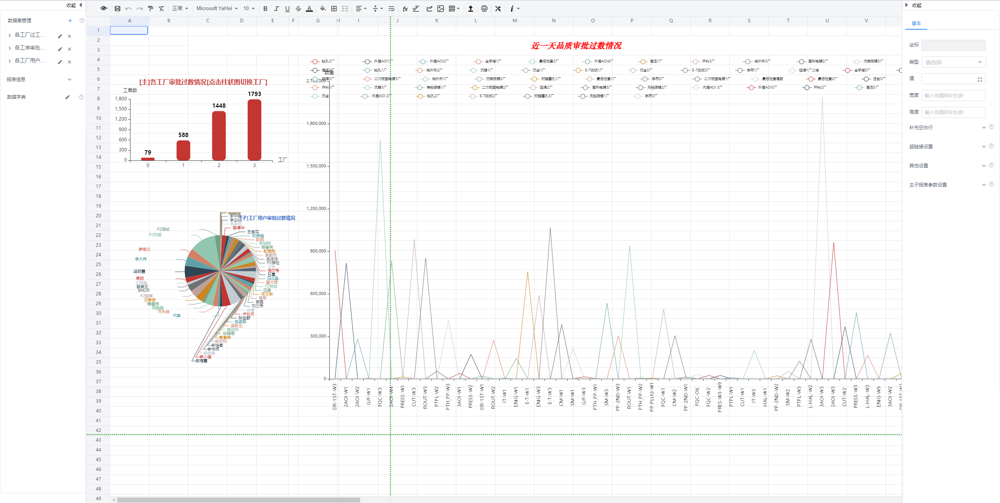
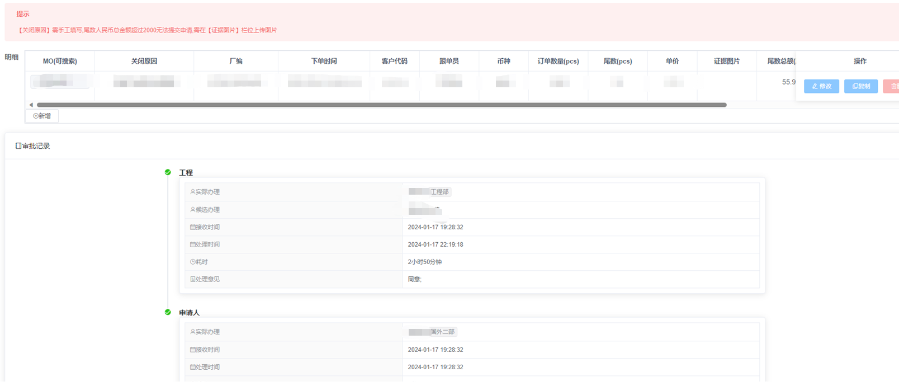

<h1 align="center" style="margin: 30px 0 30px; font-weight: bold;">JoveFast v3.6.2</h1>
<h4 align="center">基于若依Cloud的 Vue/Element UI 和 Spring Boot/Spring Cloud & Alibaba 前后端分离的分布式微服务架构</h4>
<a href='https://gitee.com/wxjstudy/jove-fast'></img></a>


## 项目简介
基于若依Cloud的Jove-Fast微服务项目，主要集成了 [积木报表](http://jimureport.com/),工作流[flowable](https://www.flowable.com/)

预览地址:[https://acechengui.github.io/jove-fast-ui/](https://acechengui.github.io/jove-fast-ui/)(条件有限,后台服务器已到期)

* 账号密码admin/Psitadmin
* 采用前后端分离的模式
* 后端采用Spring Boot、Spring Cloud & Alibaba。
* 注册中心、配置中心选型Nacos，权限认证使用Redis。
* 流量控制框架选型Sentinel.
* 分布式锁选型redisson.

## 表调整
* 部门表调整，增加了一列 describes，主要作用于积木设置当前登录用户部门描述

```
    @Override
    public Map<String, Object> getUserInfo(String token) {
        // 将所有信息存放至map 解析sql会根据map的键值解析,可自定义其他值
        Map<String, Object> map = new HashMap<>(20);
        LoginUser loginUser = tokenService.getLoginUser(token);
        map.put("sysUserCode",loginUser.getUsername());
        //设置当前日期（年月日）
        map.put("sysData",DateUtils.getDate());
        //设置昨天日期（年月日）
        map.put("sysYesterDay",DateUtils.getyesterday());
        //设置当前登录用户昵称
        map.put("sysUserName",loginUser.getSysUser().getNickName());
        //设置当前登录用户部门ID
        map.put("deptId",loginUser.getSysUser().getDeptId());
        //设置当前登录用户部门描述
        map.put("describe",loginUser.getSysUser().getDept().getDescribes());
        return map;
    }
```


* 实现同一报表，不同角色的人看到的列数据不一样的结果，两个注解解决

```
    /**
     * 使用示例：在实现类方法上增加@ColAssign，用于标识需要返回修改的注入点
     *
     * @param params
     */
    @Override
    @ColAssign
    public List<PcbstatementVO> getPcbstatement(PcbstatementVO params) {
        return engineeringMapper.selectPcbstatement(params);
    }

    /**
     * 使用示例：在bean的属性上增加@Assign，其中roleCallout的值为角色代码，用逗号分割标识多个角色
     *
     * @param params
     */
    @Excel(name = "工程及其它费用",cellType = Excel.ColumnType.NUMERIC)
    @Assign(roleCallout = "admin,confidential")
    private Double amount;
```

* excel导出增强支持冻结首行以及开启筛选列<均为可选项>

```
    @Log(title = "客户组别管理", businessType = BusinessType.EXPORT)
    @RequiresPermissions("auxiliary:customergroup:export")
    @PostMapping("/customergroup/export")
    public void export(HttpServletResponse response, Data9977 data9977)
    {
        List<Data9977> list = iErpSalesmoduleservice.getCustomerGroupList(data9977);
        ExcelUtil<Data9977> util = new ExcelUtil<Data9977>(Data9977.class);
        /**
         第四个参数是否冻结首行
         第五个参数是否筛选列
         */
        util.exportExcel(response, list, "客户组别信息",true,true);
    }
```


## 积木报表




1.5.6版本升级日志:
```markdown
ALTER TABLE jimu_report_data_source
ADD COLUMN type  varchar(10) NULL COMMENT '类型(report:报表;drag:仪表盘)';
UPDATE jimu_report_data_source SET type= 'report';
``` 

## 工作流引擎




## 分布式锁
Redisson是Redis官方推荐的Java版的Redis客户端,此处我们只用它的分布式锁功能。使用:
1. 在需要引入分布式锁的模块中pom引入,yml增加配置
```markdown
    <!-- Redisson 锁功能 -->
    <dependency>
        <groupId>org.redisson</groupId>
        <artifactId>redisson-spring-boot-starter</artifactId>
    </dependency>


# yml配置 redisson
redisson:
    address: redis://127.0.0.1:6379
    # 选哪个库
    database: 15  
    # 密码,若无密码可删除
    password: joveadmin 
``` 
2. 在相应的模块中增加工具类
```markdown

/**
 * redis锁工具类
 *
 * @author Acechengui
 */
@Component
public class RedisLock
{
    @Autowired
    private RedissonClient redissonClient;

    /**
     * 获取锁
     *
     * @param lockKey 锁实例key
     * @return 锁信息
     */
    public RLock getRLock(String lockKey)
    {
        return redissonClient.getLock(lockKey);
    }

    /**
     * 加锁
     * 
     * @param lockKey 锁实例key
     * @return 锁信息
     */
    public RLock lock(String lockKey)
    {
        RLock lock = getRLock(lockKey);
        lock.lock();
        return lock;
    }

    /**
     * 加锁
     * 
     * @param lockKey 锁实例key
     * @param leaseTime 上锁后自动释放锁时间
     * @return true=成功；false=失败
     */
    public Boolean tryLock(String lockKey, long leaseTime)
    {
        return tryLock(lockKey, 0, leaseTime, TimeUnit.SECONDS);
    }

    /**
     * 加锁
     * 
     * @param lockKey 锁实例key
     * @param leaseTime 上锁后自动释放锁时间
     * @param unit 时间颗粒度
     * @return true=加锁成功；false=加锁失败
     */
    public Boolean tryLock(String lockKey, long leaseTime, TimeUnit unit)
    {
        return tryLock(lockKey, 0, leaseTime, unit);
    }

    /**
     * 加锁
     * 
     * @param lockKey 锁实例key
     * @param waitTime 最多等待时间
     * @param leaseTime 上锁后自动释放锁时间
     * @param unit 时间颗粒度
     * @return true=加锁成功；false=加锁失败
     */
    public Boolean tryLock(String lockKey, long waitTime, long leaseTime, TimeUnit unit)
    {
        RLock rLock = getRLock(lockKey);
        boolean tryLock = false;
        try
        {
            tryLock = rLock.tryLock(waitTime, leaseTime, unit);
        }
        catch (InterruptedException e)
        {
            return false;
        }
        return tryLock;
    }

    /**
     * 释放锁
     * 
     * @param lockKey 锁实例key
     */
    public void unlock(String lockKey)
    {
        RLock lock = getRLock(lockKey);
        lock.unlock();
    }

    /**
     * 释放锁
     * 
     * @param lock 锁信息
     */
    public void unlock(RLock lock)
    {
        lock.unlock();
    }
}

```
3.调用
```markdown
@Autowired
private RedisLock redisLock;

// lockKey 锁实例key waitTime 最多等待时间 leaseTime 上锁后自动释放锁时间  unit 时间颗粒度
redisLock.lock(lockKey);
redisLock.tryLock(lockKey, leaseTime);
redisLock.tryLock(lockKey, leaseTime, unit);
redisLock.tryLock(lockKey, waitTime, leaseTime, unit);
redisLock.unlock(lockKey);
redisLock.unlock(lock);
``` 
## 目录结构

~~~
com.jovefast     
├── jovefast-gateway         // 网关模块
├── jovefast-auth            // 认证中心
├── jovefast-flowable        // 工作流中心
├── jovefast-api             // 接口模块
│       └── jovefast-api-system                          // 系统接口
├── jovefast-common          // 通用模块
│       └── jovefast-common-core                         // 核心模块
│       └── jovefast-common-datascope                    // 权限范围
│       └── jovefast-common-datasource                   // 多数据源
│       └── jovefast-common-log                          // 日志记录
│       └── jovefast-common-redis                        // 缓存服务
│       └── jovefast-common-seata                        // 分布式事务
│       └── jovefast-common-security                     // 安全模块
│       └── jovefast-common-swagger                      // 系统接口
├── jovefast-modules         // 业务模块
│       └── jovefast-system                              // 系统模块 
│       └── jovefast-gen                                 // 代码生成 
│       └── jovefast-job                                 // 定时任务 
│       └── jovefast-file                                // 文件服务 
│       └── jovefast-report                                // 报表服务
├── jovefast-visual          // 图形化管理模块
│       └── jovefast-visual-monitor                      // 监控中心 
├──pom.xml                // 公共依赖
~~~

## 架构图


## 摸鱼交流
本人普通码农一枚，产生了想搞开源项目的想法，虽能力有限，但竭尽所能，说干就干~~
欢迎大家进群交流，本项目将一直开源。
点击链接加入群聊【Java/Vue摸鱼交流群】：
[](https://jq.qq.com/?_wv=1027&k=Y2XSJ0BC) 